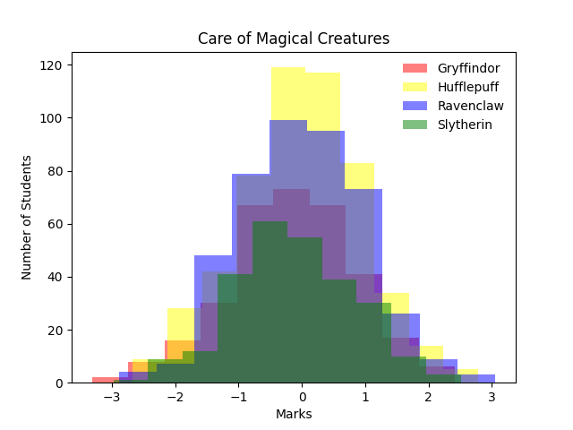
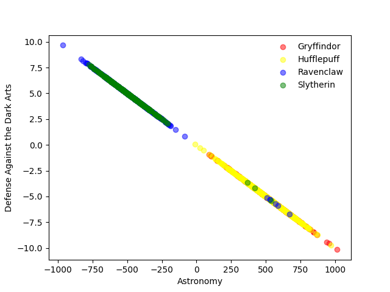
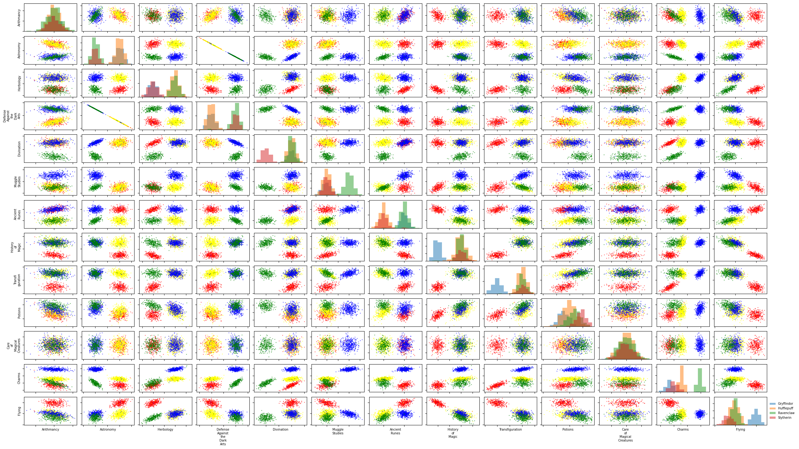
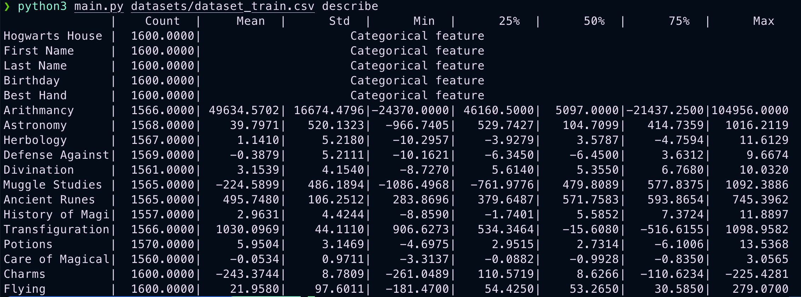

# DSLR Project

The DSLR (Data Science and Logistic Regression) project from 42 School is centered around implementing logistic regression to classify and analyze data from a given dataset. This project aims to provide students with a practical understanding of machine learning principles, particularly logistic regression, data preprocessing, and model evaluation.

## Features

- **Data Preprocessing**: Reads and cleans data to prepare it for analysis and model training.
- **Logistic Regression Implementation**: Implements logistic regression from scratch to classify data points effectively.
- **Model Training and Testing**: Trains the logistic regression model using a dataset and evaluates its performance using metrics such as accuracy, precision, and recall.
- **Data Visualization**: Visualizes data distribution and model predictions to gain insights into the classification process.

## Visualizations

### 1. Histogram
This script plots a histogram for the feature with a homogeneous score.



### 2. Scatter Plot
This script generates a scatter plot to visualize the relationship between two features.



### 3. Pair Plot
This script creates a pair plot to show pairwise relationships between features.



### 4. Describe Method Output
This script runs a custom describe function to summarize statistics for each feature.



## Scripts

- `histogram.py`: Plots histogram for the feature with homogeneous score. See the result in the image above.
- `scatterplot.py`: Generates scatter plot for feature comparisons.
- `pairplot.py`: Creates pair plots for visual analysis.
- `describe.py`: Outputs statistical summary of features.

## How to Run

1. Place the dataset in the required format in the project directory.
2. Run the respective Python script for the visualization or analysis you want to perform.

```bash
python3 main.py datasets/dataset_train.csv action=[histogram, scatterplot, pairplot]
